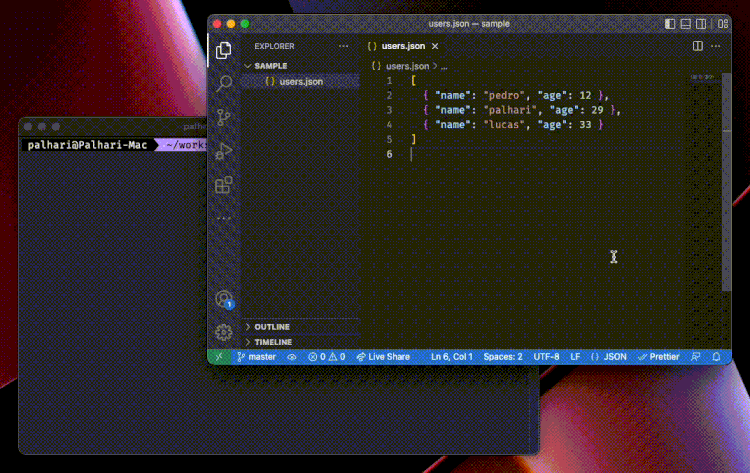

# ⚡️ nq

`nq` is a batteries included tool to map JSON!

- **TIP:** for best usage and autocomplete, make sure VSCode is accessible through `code` on your bash.

# 🎥 Preview



# 📝 Examples

- Installing globally

```bash
npm i -g @palhari/nq

echo '{ "users": [{ "name": "pedro" }, { "name": "palhari" }]}' | nq

# or also
nq <file>
```

- Using `npx`

```bash
echo '{ "users": [{ "name": "pedro" }, { "name": "palhari" }]}' | npx @palhari/nq

# or also
npx @palhari/nq <file>
```

# 🤔 How to use it

- You invoke `nq` on a JSON of choice.
- A VSCode window appears with a default exported function.
- The function has a parameter, `json`. The parameter has autocomplete from the input JSON.
- Close the VSCode tab, the function runs.

# ⚙️ Options

- `-n`, open in a new VSCode instance

# 🧠 Motivation

I'm a very big fan of `jq`. Unfortunately, I'm as much equally dumb to use it.

I really *really* like autocompletion. Besides strict typechecking it's a must, specially in small scripts you're tinkering with. Making sense of data needs to be visual and comprehensible. 

My aim is to bring a little bit of that here.

# Acknowledgments

There are two big main libraries that this project heavily depends on, [tsm](https://github.com/lukeed/tsm) and [json-to-ts](https://github.com/MariusAlch/json-to-ts). `tsm` is used to provide the runtime with a fast transpiler for the typescript function and `json-to-ts` is used to generate types from the input JSON. Be sure to check them out as they're really powerful on their own.

Also, [nanoid](https://github.com/ai/nanoid) is used for the file names.